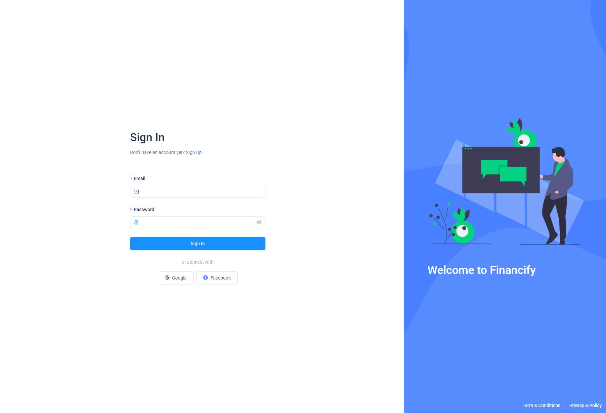
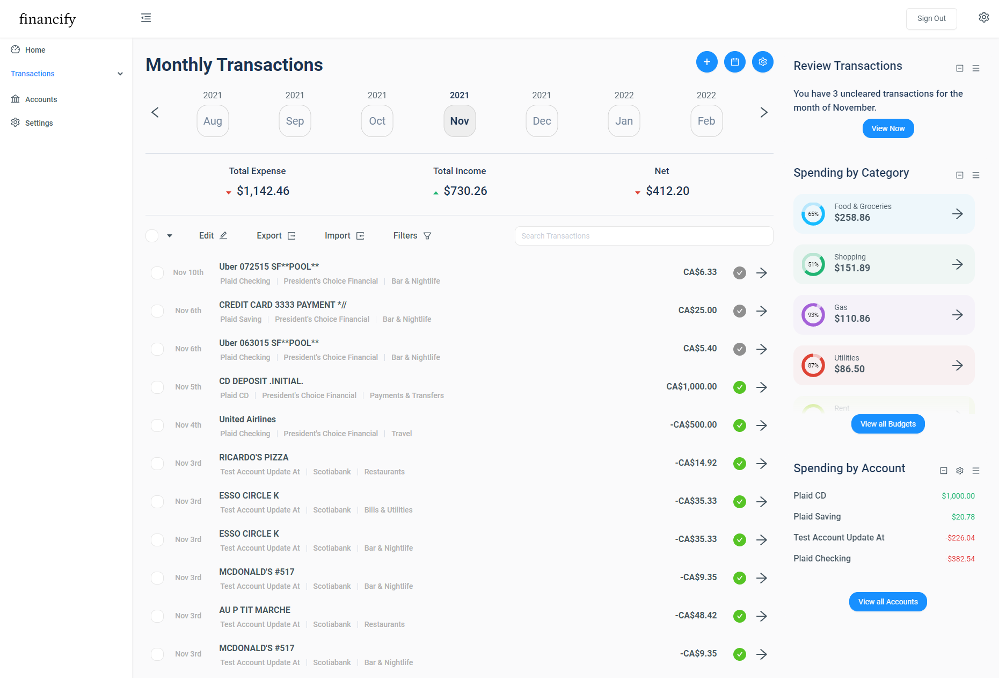

# Full Stack Personal Finance Web App

This is a personal finance application that allows users to link their bank account via the Plaid API. Current functionality includes basic authentication via JSON Web Token, and the addition, deletion, and refreshing of a bank account. The application will display the user's account balances and transactions.

Note that this is an incomplete repository. A majority of the codebase has been redacted as I plan to release this into production hopefully by the end of 2022.

## Screenshots

#### Login/Registration Page

#### Transactions Page

## High Level Features

A user can:

1. Add manually tracked bank accounts of various types
2. Link their bank accounts through Plaid
3. Import transactions through Plaid
4. Add manually tracked transactions
5. Attach categories to transactions
6. Attach tags to transactions
7. Create transaction rules based on transaction meta data which can trigger different events to take on a specific transaction (rename, attach category, tags, etc.)
8. Add a budget to a category
